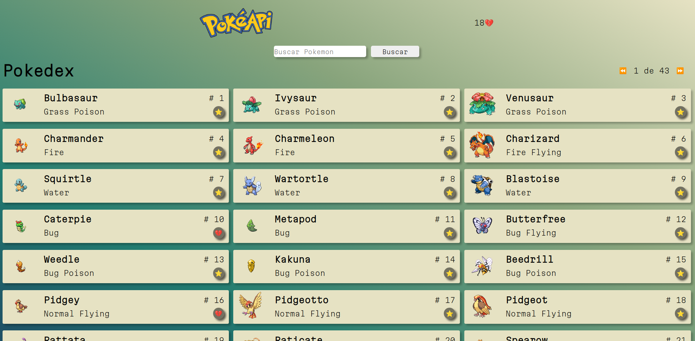

# Pokedex

Pokedex em  React JS, utilizando os dados da API,  PokéAPI.

### Features

- Buscar os dados da API.
- Pesquisar os pokemons.
- Favoritar os pokemons utilizando o useContext.
- Paginação.
- Salvar os dados em localStorage.

